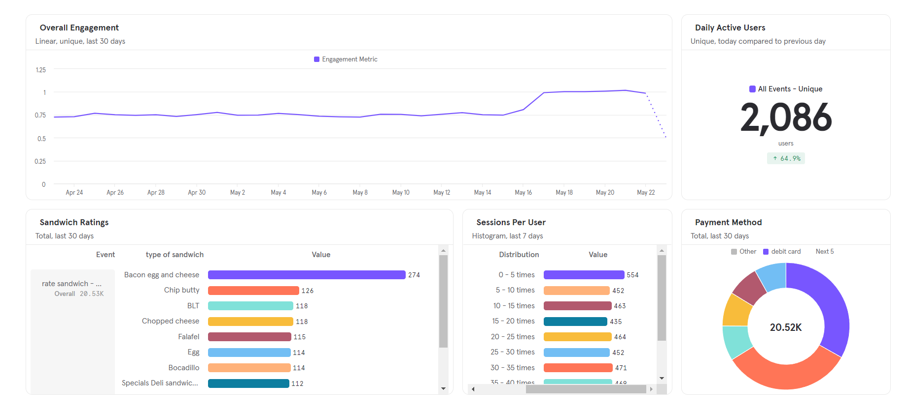
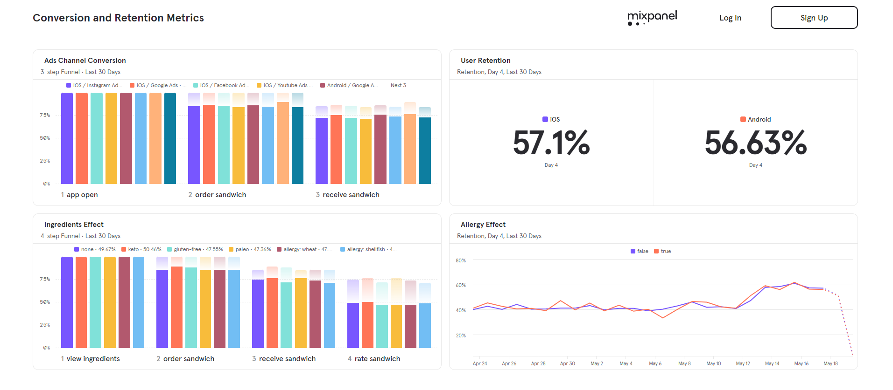

<!-- PROJECT LOGO -->
 

    
  </a>

  <h3 align="center">Food APP ANALYSIS</h3>

<!-- ABOUT THE PROJECT -->
## About The Project

This project uses mixpanel to answer various questions like: 

1. User Daily Enangement
2. Most order food and preferred payment method
3. Ads effectiveness on user retention
4. User activites on app which make him palce an order

## Public Dashboards
 * [Engagement Metrics](https://mixpanel.com/public/Nt4trxTNrQtQ1GCN6DcGyJ)

* [Conversion and Retention Metrics](https://mixpanel.com/public/Qey9eXuGqu4xCv9atBJ5tv)

 
  
 

 
